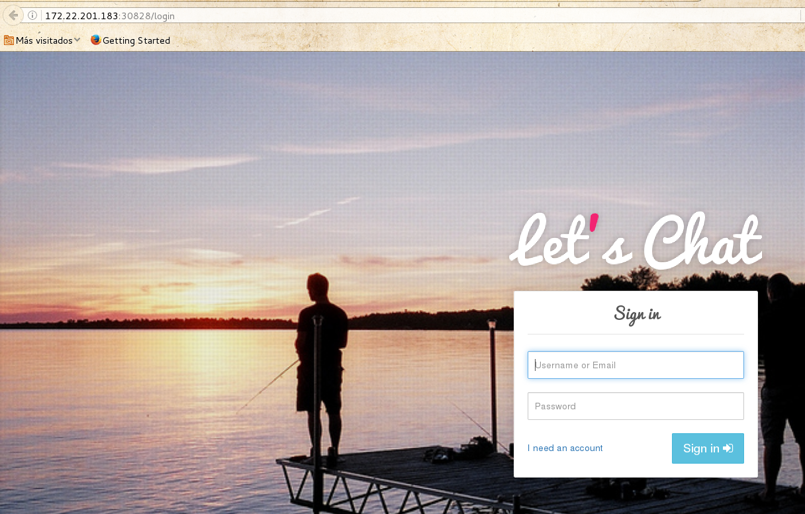

# Despliegue de una aplicación web en kubernetes

En este apartado vamos a instalar una aplicación web (CMS) en kubernetes, vamos a instalar un chat, llamado letscahat, que está escrito en node.js y utiliza una base de datos mongo. Por lo tanto vamos a crear dos PODS:

* Uno con la aplicación letschat, este pods lo vamos poder escalar sin problemas.
* Otro con la base de datos mongo, para que el almacenamiento de la base de datos sea presistente vamos a utilizar un volumen, en este caso para que sea más simple vamos a usar un directorio en el sistema de archivo. Por lo tanto este pod no se va a poder escalar. Podríamos usar otras soluciones de almacenamientos distribuido (glusterFS, NFS, Ceph,...) para compartir un volumen entre los nodos del cluster y de esta manera este pod pudiera escalarse.

## Creación del despliegue del pod de mongoDB

Vamos a crear un fichero `mongo-deploy.yaml` con el siguiente contenido:

	apiVersion: apps/v1beta1
	kind: Deployment
	metadata:
	  labels:
	    name: mongo
	  name: mongo-controller
	spec:
	  replicas: 1
	  template:
	    metadata:
	      labels:
	        name: mongo
	    spec:
	      containers:
	      - image: mongo
	        name: mongo
	        ports:
	        - name: mongo
	          containerPort: 27017
	          hostPort: 27017
	        volumeMounts:
	            - name: mongo-persistent-storage
	              mountPath: /data/db
	      volumes:
	        - name: mongo-persistent-storage
	          hostPath:
	            path: /data

Y creamos el recurso `deployment` de la siguiente forma:

	$ kubectl create -f mongo-deploy.yaml 
	deployment "mongo-controller" created

Y comprobamos que se ha creado sin problemas:

	$ kubectl get deploy,pods
	NAME                      DESIRED   CURRENT   UP-TO-DATE   AVAILABLE   AGE
	deploy/mongo-controller   1         1         1            1           1m	

	NAME                                 READY     STATUS        RESTARTS   AGE
	po/mongo-controller-54519668-vcvg8   1/1       Running       0          1m

## Creación del servicio mongodb

Para que internamente se pueda acceder a la base de datos, vamos a crear un recurso `service` relacionado con el pod anterior, para ello creamos un fichero `mongo-srv.yaml` con el siguiente contenido:

	apiVersion: v1
	kind: Service
	metadata:
	  labels:
	    name: mongo
	  name: mongo
	spec:
	  ports:
	    - port: 27017
	      targetPort: 27017
	  selector:
	    name: mongo

Cramos el servicio y comprobamos que se ha creado:

	$ kubectl create -f mongo-srv.yaml 
	service "mongo" created	

	$ kubectl get services
	NAME         CLUSTER-IP      EXTERNAL-IP   PORT(S)     AGE
	mongo        10.98.106.132   <none>        27017/TCP   12s

## Creación del despliegue de la aplicación letschat

De la misma manera que anteriormente ahora creamos el fichero `letschat-deploy-yaml`:

	apiVersion: apps/v1beta1
	kind: Deployment
	metadata:
	  labels:
	    name: letschat
	  name: letschat-controller
	spec:
	  replicas: 1
	  selector:
	    matchLabels:
	      name: letschat
	  template:
	    metadata:
	      labels:
	        name: letschat
	    spec:
	      containers:
	      - image: sdelements/lets-chat
	        name: letschat
	        ports:
	        - containerPort: 3000
	          name: http-server

Lo creamos y comprobamos su creación:

	$ kubectl create -f letschat-deploy.yaml 
	deployment "letschat-controller" created

	$ kubectl get deploy,pods 
	NAME                         DESIRED   CURRENT   UP-TO-DATE   AVAILABLE   AGE
	deploy/letschat-controller   1         1         1            1           40s
	deploy/mongo-controller      1         1         1            1           11m	

	NAME                                      READY     STATUS        RESTARTS   AGE
	po/letschat-controller-2582320606-ns0hm   1/1       Running       0          40s
	po/mongo-controller-54519668-vcvg8        1/1       Running       0          11m

## ## Creación del servicio letschat

Teniendo en cuenta que ahora vamos a poder acceder desde el exterior a la aplicación crearemos el `service` de la siguiente manera en el fichero letscaht-srv.yaml`:

	apiVersion: v1
	kind: Service
	metadata:
	  name: letschat
	  labels:
	    name: letschat
	spec:
	  type: NodePort
	  ports:
	    - port: 8080
	  selector:
	    name: letschat

Lo creamos y creamos el puerto que ha sido asignado:

	$ kubectl create -f letschat-srv.yaml 
	service "letschat" created	

	$ kubectl get svc
	NAME         CLUSTER-IP      EXTERNAL-IP   PORT(S)          AGE
	...
	letschat     10.106.77.77    <nodes>       8080:30828/TCP   4s

Por lo tanto podemos acceder a la aplicación utilizando la ip del master y el puerto asignado en el servicio:

Puedes acceder a todos los ficheros en el siguiente [directorio](https://github.com/iesgn/curso-ual17/tree/master/letschat).