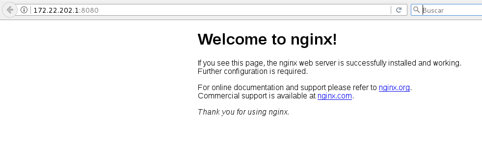
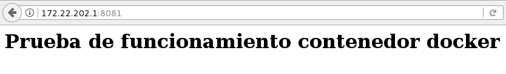
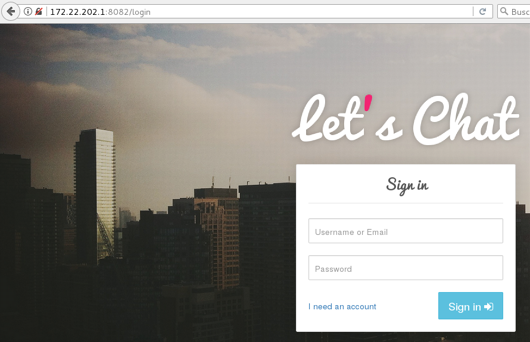

# Introducción a Docker

Docker es un proyecto de software libre que permite automatizar el despliegue de aplicaciones dentro de contenedores.

Docker nos permite, de una forma sencilla, crear contenedores  ligeros y portables donde ejecutar nuestras aplicaciones software sobre cualquier máquina con Docker instalado, independientemente del sistema operativo que la máquina tenga por debajo, facilitando así también los despliegues. De ahí que el lema de Docker sea: **"Build, Ship and Run. Any application, Anywhere"** y se haya convertido en una herramienta fundamental tanto para desarrolladores como para administradores de sistemas.

Docker está formado fundamentalmente por tres componentes:

* Docker Engine: Es un demonio que corre sobre cualquier distribución de Linux y que expone una API externa para la gestión de imágenes y contenedores. Con ella podemos crear imágnenes, subirlas y bajarla de un registro de docker y ejecutar y gestionar contenedores.
* Docker Client: Es el cliente de línea de comandos (CLI) que nos permite gestionar el Docker Engine. El cliente docker se puede configurar para trabajar con con un Docker Engine local o remoto, permitiendo gestionar tanto nuestro entorno de desarrollo local, como nuestro entorno de producción.
* Docker Registry: La finalidad de este componente es almacenar las imágenes generadas por el Docker Engine. Puede estar instalada en un servidor independiente y es un componente fundamental, ya que nos permite distribuir nuestras aplicaciones. Es un proyecto open source que puede ser instalado gratuitamente en cualquier servidor, pero, como hemos comentado, el proyecto nos ofrece Docker Hub.

## Instalación de docker en Ubuntu 16.04

Instalamos el repositorio ofical de docker:

	sudo apt-get install apt-transport-https ca-certificates curl software-properties-common

	curl -fsSL https://download.docker.com/linux/ubuntu/gpg | sudo apt-key add -

	sudo apt-key fingerprint 0EBFCD88

	sudo add-apt-repository "deb [arch=amd64] https://download.docker.com/linux/ubuntu  $(lsb_release -cs) stable"

A continuación, instalamos docker:

	sudo apt-get update
	sudo apt-get install docker-ce

Para que el usuario `ubuntu` pueda utilizar el docker cli:

	sudo usermod -aG docker ubuntu

## Ejecución de un contenedor

Ahora vamos a crear un nuevo contenedor a partir de una imagen de `ngnix`. Este contenedor lo vamos a crear usando la opción -d que nos permite "demonizar" el contenedor, es decir que se ejecute indefinidamente. Con la opción -p mapeamos un puerto del equipo donde tenemos instalado el docker engine, con un puerto del contenedor.

	docker run --name contendor-nginx -d -p 8080:80 nginx

Comprobamos que se ha descargado la imagen de `nginx`:

	docker image ls
	REPOSITORY          TAG                 IMAGE ID            CREATED             SIZE
	nginx               latest              3448f27c273f        4 days ago          109 MB

Y que tenemos un contenedor corriendo:

	docker ps
	CONTAINER ID        IMAGE               COMMAND                  CREATED             STATUS              PORTS                  NAMES
	307230c23c3b        nginx               "nginx -g 'daemon ..."   37 seconds ago      Up 36 seconds       0.0.0.0:8080->80/tcp   contendor-nginx

Ahora podemos acceder al puerto 8080 de nuestra máquina:

## Creación de imágenes con Dockerfile

Si queremos personalizar una imagen, podemos definirla a partir de una imagen base en un fichero Dockerfile, y posteriormente crearla con el comando `docker build`. Por ejemplo podemos tener un fichero `Dockerfile` (dentro de un directorio `my_nginx`) con el siguiente contenido:

	FROM nginx
	ADD ["index.html","/usr/share/nginx/html"]

Y un fichero `index.html` con el contenido que deseemos:

	echo "<h1>Prueba de funcionamiento contenedor docker</h1>">index.html

Y construimos nuestra nueva imagen:

	my_nginx$ docker build -t my_nginx .
	Sending build context to Docker daemon 3.072 kB
	Step 1/2 : FROM nginx
	 ---> 3448f27c273f
	Step 2/2 : ADD index.html /usr/share/nginx/html
	 ---> 79736ba84bd9
	Removing intermediate container 625e9131da4f
	Successfully built 79736ba84bd9

Comprobamos que tenemos una nueva imagen:
	
	docker image ls
	REPOSITORY          TAG                 IMAGE ID            CREATED              SIZE
	my_nginx            latest              79736ba84bd9        About a minute ago   109 MB
	nginx               latest              3448f27c273f        4 days ago           109 MB

Y creamos un nuevo contenedor:

	docker run --name contendor-my-nginx -d -p 8081:80 my_nginx
	ad717f6a857c7b0b3360ff75a610c33f01ad0c9877ea2557c92830761813a15c
	
	ubuntu@docker-2:~/my_nginx$ docker ps
	CONTAINER ID        IMAGE               COMMAND                  CREATED             STATUS              PORTS                  NAMES
	ad717f6a857c        my_nginx            "nginx -g 'daemon ..."   9 seconds ago       Up 9 seconds        0.0.0.0:8081->80/tcp   contendor-my-nginx
	307230c23c3b        nginx               "nginx -g 'daemon ..."   29 minutes ago      Up 21 minutes       0.0.0.0:8080->80/tcp   contendor-nginx

Y accedemos al nuevo contenedor:

## Despligue de una aplicación web 

Para terminar vamos a instalar una aplicación web desarrollada en node.js, que utiliza una base de datos mongodb, para ello vamos acrear dos contenedores:

	docker run --name contendor-mongo -d mongo

	docker run  --name contenedor-letschat --link contendor-mongo:mongo -p 8082:8080 -d sdelements/lets-chat

## Más información

* [Documentación de docker](https://docs.docker.com/)
* [Introducción a docker](http://www.josedomingo.org/pledin/2015/12/introduccion-a-docker/)
* [Primeros pasos con Docker](http://www.josedomingo.org/pledin/2016/02/primeros-pasos-con-docker/)
* [Ejecutando una aplicación web en docker](http://www.josedomingo.org/pledin/2016/02/ejecutando-una-aplicacion-web-en-docker/)
* [Dockerfile: Creación de imágenes docker](http://www.josedomingo.org/pledin/2016/02/dockerfile-creacion-de-imagenes-docker/)
* [Ejemplos de ficheros Dockerfile, creando imágenes docker](http://www.josedomingo.org/pledin/2016/02/ejemplos-de-ficheros-dockerfile-creando-imagenes-docker/)
* [Gestionando el registro Docker Hub](http://www.josedomingo.org/pledin/2016/02/gestionando-el-registro-docker-hub/)
* [Enlazando contenedores docker](http://www.josedomingo.org/pledin/2016/02/enlazando-contenedores-docker/)
* [Creando servidores docker con Docker Machine](http://www.josedomingo.org/pledin/2016/05/creando-servidores-docker-con-docker-machine/)
* [Gestión del almacenamiento en docker](http://www.josedomingo.org/pledin/2016/05/gestion-del-almacenamiento-en-docker/)
* [Gestionando el almacenamiento docker con Dockerfile](http://www.josedomingo.org/pledin/2016/11/gestionando-el-almacenamiento-docker-con-dockerfile/)
