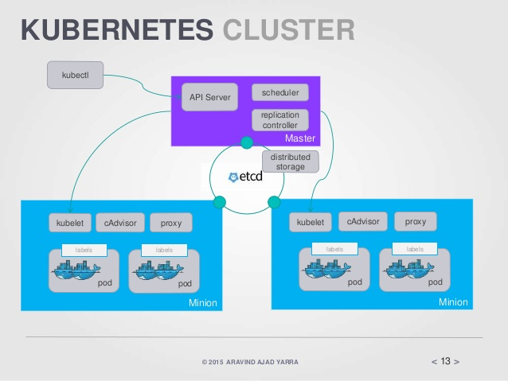
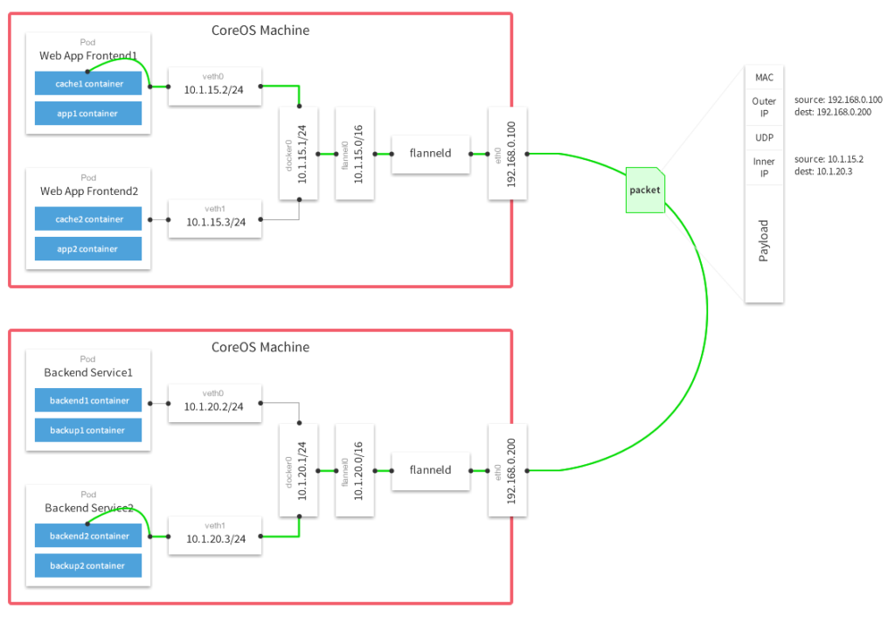

# Introducción a Kubernetes

Es un proyecto open source de Google para la gestión de aplicaciones en contenedores, en especial los contenedores Docker, permitiendo programar el despliegue, escalado, monitorización de los contenedores, etc.

## Arquitectura

Un clúster de Kubernetes está formado por nodos o minions (kubelet) y por los componentes del Master (APIs, scheduler, etc) encima de una solución de almacenamiento distribuido.

## Kubernetes Master

El servidor master va a controlar el clúster. Es el punto dónde se otorga a los servicios de clúster información de todos los nodos, y corre los siguientes servicios:

* etcd: es una base de datos altamente disponible que almacena
claves-valor en el que Kubernetes almacena información (configuración y metadatos) acerca del estado del cluster.
* Scheduler (Kube-scheduler): se encarga de distribuir los pods entre los nodos, asigna los pods a los nodos. También es el responsable de monitorizar la utilización de recursos de cada host para asegurar que los pods no sobrepasen los recursos disponibles.
* API Server (kube-apiserver): Provee la API que controla la orquestación de Kubernetes El api server expone una interfaz REST.
* Controller manager: es un servicio usado para manejar el proceso de replicación definido en las tareas de replicación. 

## Kubernetes Node

En el nodo se ejecutan todos los componentes y servicios necesarios para correr aplicaciones y balancear el tráfico entre servicios (endpoints). Posee los siguientes servicios:

* Docker o rkt: son los motores de contenedores que funcionan en cada nodo descargando y corriendo las imágenes docker. Son controlados a través de sus APIs por Kubelet.
Kubelet: gestiona los pods y sus contenedores, sus imágenes, sus volúmenes, etc. Cada nodo corre un Kubelet, que es el responsable del registro de cada nodo y de la gestión de los pods.
* cAdvisor: es un agente de uso de los recursos y análisis que descubre todos los contenedores en la máquina y recoge
información sobre CPU, memoria, sistema de ficheros y estadísticas de uso de la red. 
* Flannel: provee redes y conectividad para los nodos y contenedores en el clúster. 
* Proxy (Kube-proxy): provee servicios de proxy de red. Cada nodo también ejecuta un proxy y un balanceador de carga. 

## Otros conceptos

* PODs (dockers): son la unidad más pequeña desplegable que puede ser creada, programada y manejada por Kubernetes. Son un grupo de contenedores Dockers, de aplicaciones que comparten volúmenes y red. 
* Replication   Controller, Deployment y ReplicaSet: son distintos mecanismos que para segurar que el número especificado de réplicas del pod estén ejecutándose y funcionando en todo momento. 
Cluster: Conjunto de máquinas físicas o virtuales y otros recursos (almacenamiento, red, etc.) utilizados por Kubernetes dónde pods son desplegados, gestionados y replicados. 
* Service: es una abstracción (un nombre único) que define un conjunto de pods y la lógica para acceder a los mismos. Los servicios ofrecen la capacidad para buscar y distribuir el tráfico proporcionando un nombre y dirección o puerto persistente para los pods con un conjunto común de labels.
Labels: son pares clave/valor usados para agrupar, organizar y seleccionar un grupo de objetos tales como Pods. Son fundamentales para que los services y los replications controllers obtengan la lista de los servidores a donde el tráfico debe pasar.

## Redes en kubernetes

En Kubernetes es primordial que los nodos tengan acceso a internet para poder ofrecer sus
servicios. También es importante que los nodos se comuniquen entre ellos y compartan recursos y
datos. En el caso de un clúster Kubernetes existen dos elementos para resolver esto: 

* Los contenedores dentro de un nodo se comunican por la interfaz de red creada por docker:

	* Docker0: Para el acceso de los contenedores a la red se crea una subred virtual con un segmento de red privado, administrado por una interfaz virtual que sirve de puente. Esta interfaz se crea en el momento de instalar Docker y se llama Docker0. El demonio Docker añade la interfaz a dicha subred. Cada contenedor tiene su propia IPv4 en la subred y hacen NAT.

* Para comunicar contenedores entre diferentes nodos podemos utilziar varias implementaciones, la más usada es Flannel:

	* Flannel: Desarrollado por CoreOS y pensado para Kubernetes, permite que las distintas subredes entre los nodos se comuniquen entre sí. Funciona como una virtual extended LAN (VXLAN), que crea un número identificador de red. Cada nodo utiliza una interfaz virtual llamada flannel que administra el segmento de red de cada subred.

## Volúmenes en kubernetes

Los archivos en disco en un contenedor son efímeros, lo que representa algunos problemas para las aplicaciones cuando corren en contenedores. En primer lugar, cuando un contenedor se rompe, Kubelet lo reiniciará pero los archivos se perderán y el contenedor se iniciará limpio. En segundo lugar cuando dos contenedores corren en un Pod, a veces es necesario que compartan archivos entre ellos. Los volúmenes de Kubernetes resuelven ambos problemas.

Kubernetes nos ofrece múltiples tipos de volúmenes. En esencia un volumen sólo es un directorio con datos, que son accesibles por los contenedores de un Pod.

Veamos también el concepto de volumen persistenete. Kubernetes proporciona una API para que usuarios y administradores puedan aprovisionar el almacenamiento dependiendo del consumo.

* PersistentVolume (PV): Es un recurso del cluster que ha sido aprovisionado por un administrador. Con el
especificamos el volumen persistente. Su ciclo de vida no depende de los Pods que hacen uso de él.
* PersistentVolumeClaim: Es una petición de almacenamiento por parte del usuario, reclamamos espacio en el
volumen. Es similar a un Pod. Consume recursos del PV. Se pueden especificar tamaño y modo de
acceso.

