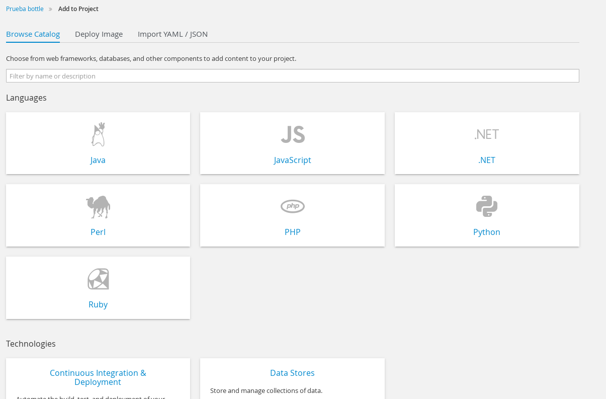
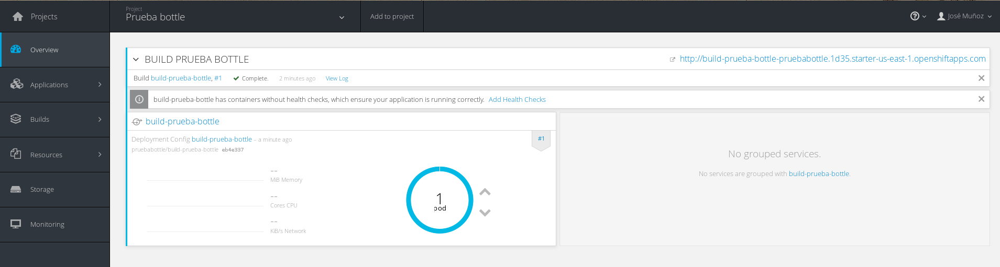
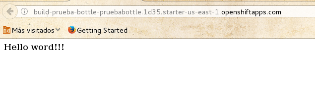
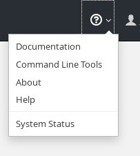

# Introducción a OpenShift 3

Openshift 3 es un PaaS que utiliza contenedores (docker y kebernetes) para la construcción, ejecución y despliegue de aplicaciones. 

Entre sus características podemos destacar las siguientes:

* Portabilidad de las aplicaciones: al estar construido en base a contenedores con Docker, esto permite que nuestra aplicación sea migrada a cualquier sistema que utilice Docker.
* OpenSource: con todas las posibilidades y ventajas que el software libre nos proporciona.
* Escalable: permite que las aplicaciones escalen de forma sencilla y automática.
* Multilenguaje: permite la utilización de diferentes lenguajes, plataformas, bases de datos... permitiendo a los desarrolladores utilizar todas las posibilidades de Docker.
* Automatización: Openshift automatiza la construcción de tu aplicación, su despliegue, su escalado, la gestión de estado...

## Conceptos básicos

* **Proyecto**: es la unidad de agrupación de aplicaciones, permisos...
* **Servicio (services)**: cada servicio representa a cada una de las aplicaciones que tengamos en nuestro proyecto, el servicio será el punto de entrada a la aplicación y expondrá unos puertos para su comunicación. 
* **Ruta (routes)**: la ruta es la URL asociada a un servicio para que podamos invocarlo, una ruta puede estar abierta a Internet o ser solo de uso interno. 
* **Despliegue (deployments)**: representa la configuración de despliegue para esa aplicación, en ella se indica el número de instancias, su configuración, qué imagen de contenedor utilizar, parámetros de escalado... 
* Pod: cada instancia que deseemos ejecutar de nuestra aplicación se ejecutará en un pod diferente.
* **Build**: Es un recurso que nos permite crear los despliegues, servicios y rutas correspondientes a una aplicación, a partir de tres mecanismos:

    * Source-to-Image (S2I): es un framework que permite, tomando el código fuente de tu aplicación como entrada, generar una imagen que ejecuta dicho código fuente. Así se creará una imagen Docker por cada versión de tu código fuente que desees ejecutar.
    * Docker build: esta estrategia ejecutará un "Docker build" y esperará a que se genere la imagen Docker en el registry para utilizarla.
    * Estrategia personalizada: esta estrategia consiste en que tú mismo crees una imagen Docker que lo que haga sea precisamente ejecutar el proceso de construcción de tu aplicación en otra imagen, que será la que se despliegue.

## Construcción de una aplicación con Web Console

Vamos a desplegar una aplicación bottle python que podemos ver en [https://github.com/josedom24/bottle_openshift_v3](https://github.com/josedom24/bottle_openshift_v3).
Es una aplicación construida con el microframework `bottle` que va a utilizar el servidor `gunicorn` para ejecutarla, por lo tanto esos dos paquetes estarán indicados en el fichero `requirements.txt`.

Añadimos un proyecto, le ponemos un nombre, y a continuación elegimos la estrategia de "build", en nuestro caso S2I, por lo que en el catalogo de imágenes escogemos python 2.7.

A continuación nombremos el "build" que estamos configurando, indicando también la URL del repositorio GitHub donde se encuentra la aplicación a desplegar.

Una vez que hemos accedido al dashboard observamos que se ha comenzado a realizar un "build", una vez terminado creara el deployment, service y route correspondiente a la aplicación con lo que tendremos un pod ejecutándose.

Si cambiamos el código de nuestra aplicación, tendremos que crear un nuevo build para que se cree una nueva imagen que sea desplegada.

Por último accediendo a la ruta generada para nuestro proyecto accedemos a la aplicación:

## Construcción de una aplicación con OpenShift CLI

Para obtener información del cliente de comandos, accedemos a la opción "Command Line Tools" en el ícono de ayuda.

En es ventana podremos bajarnos el cliente y copiar en el portapapeles las credenciales para conectar a OpenShift.

Nos conectamos con el siguiente comando:

	oc login https://api.starter-us-east-1.openshift.com --token=xxxxxxxxxxxxxxx

A continuación creamos un proyecto:

	oc new-project prueba-bottle

Y una aplicación:

	oc new-app python~https://github.com/josedom24/bottle_openshift_v3.git --name app-bottle                                              16:00:29 
	--> Found image 22060ec (2 weeks old) in image stream "python in project openshift" under tag :latest for "python"
	    * A source build using source code from https://github.com/josedom24/bottle_openshift_v3.git will be created
	      * The resulting image will be pushed to image stream "app-bottle:latest"
	    * This image will be deployed in deployment config "app-bottle"
	    * Port 8080/tcp will be load balanced by service "app-bottle"
	--> Creating resources with label app=app-bottle ...
	    ImageStream "app-bottle" created
	    BuildConfig "app-bottle" created
	    DeploymentConfig "app-bottle" created
	    Service "app-bottle" created
	--> Success
	    Build scheduled for "app-bottle" - use the logs command to track its progress.
	    Run 'oc status' to view your app.

Al cabo de unos instantes, vemos el estado de la aplicación:

	oc status                                                                       
	In project prueba-bottle on server https://api.starter-us-east-1.openshift.com:443	

	svc/app-bottle - 172.30.3.70:8080
	  dc/app-bottle deploys imagestreamtag/app-bottle:latest <-
	    bc/app-bottle builds https://github.com/josedom24/bottle_openshift_v3.git with openshift/python:latest 
	    #1 deployed 2 minutes ago - 1 pod

Cuando usamos `oc new-app` necesitamos explicitamente crear el servicio y la ruta de acceso, para ello:

	oc expose svc/app-bottle
	route "app-bottle" exposed

Y podemos obtener los pods que hemos creado y la rutas para obtener a la aplicación:

	oc get pods                                                                
	
	NAME                 READY     STATUS      RESTARTS   AGE
	app-bottle-1-build   0/1       Completed   0          6m
	app-bottle-1-fpbkk   1/1       Running     0          4m

	oc get routes

	NAME         HOST/PORT                                                           PATH      SERVICE      LABELS           INSECURE POLICY   TLS TERMINATION
	app-bottle   app-bottle-prueba-bottle.1d35.starter-us-east-1.openshiftapps.com             app-bottle   app=app-bottle                 

Ya podemos acceder a `app-bottle-prueba-bottle.1d35.starter-us-east-1.openshiftapps.com`.

Si modificamos nuestra aplicación y ya hemos subido los cambios al repositorio GitHub, tendríamos que hacer una nueva construcción con:

	oc start-build app-bottle

Por último para borrar nuestra aplicación:

	oc delete all --selector app=app-bottle