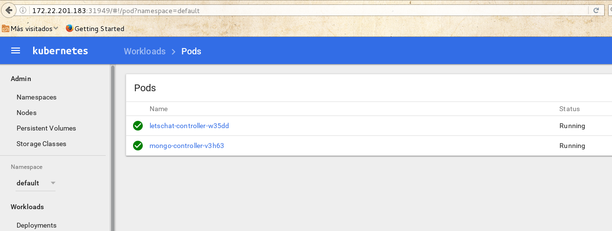

# Instalación de kubernetes en OpenStack con kubeadm

Kubeadm es una aplicación que nos oferce kubernetes para la creación de cluster kubernetes sobre máuinas físcas o virtuales. Vamos a usar Ubuntu 16.04 en 3 instancias de OpenStack para realizar la instalación:

## Instalación de los paquetes necesarios

Accedemos acada uno de los nodos e instalamos los paquetes necesarios, para ello como superusuario:

	apt-get update && apt-get install -y apt-transport-https
	curl -s https://packages.cloud.google.com/apt/doc/apt-key.gpg | apt-key add -
	cat <<EOF >/etc/apt/sources.list.d/kubernetes.list
	deb http://apt.kubernetes.io/ kubernetes-xenial main
	EOF
	apt-get update
	# Install docker if you don't have it already.
	apt-get install -y docker-engine
	apt-get install -y kubelet kubeadm kubectl kubernetes-cni

Puedes acceder a este [directorio](https://github.com/iesgn/curso-ual17/tree/master/kubeadm) donde puedes encontrar un script para realizar la instación con fabric.

## Inicializando el nodo master

En el nodo que vamos a usar como master, ejecutamos la siguiente instrucción como superusuario:

	kubeadm init --pod-network-cidr 10.0.0.0/24

Este comando inicializa el cluster, hemos indicado le CIDR de la red por donde se comunican los nodos del cluster, cuando termina muestra un mensaje similar a este:

	Your Kubernetes master has initialized successfully!	

	To start using your cluster, you need to run (as a regular user):	

	  sudo cp /etc/kubernetes/admin.conf $HOME/
	  sudo chown $(id -u):$(id -g) $HOME/admin.conf
	  export KUBECONFIG=$HOME/admin.conf	

	You should now deploy a pod network to the cluster.
	Run "kubectl apply -f [podnetwork].yaml" with one of the options listed at:
	  http://kubernetes.io/docs/admin/addons/	

	You can now join any number of machines by running the following on each node
	as root:	

	  kubeadm join --token <token> <master-ip>:<master-port>

Nos indica tres cosas:

1. Las instrucciones que tenemos que ejecutar en el master, con un usuario sin privilegios para usar el cliente `kubectl` y manejar el claster.
2. La necesidad de instalar un pod para la gestión de la red.
3. Y la instrucción que tenemos que ejecutar en los nodos para añadirlos al cluster. Utilizaremos un token para ello.

## Instalación del pod para gestionar la red

Antes de ello, en el master con un usuario sin privilegios ejecutamos las instrucciones anteriormente indicadas para usar el cliente `kubectl`:

	sudo cp /etc/kubernetes/admin.conf $HOME/
	sudo chown $(id -u):$(id -g) $HOME/admin.conf
	export KUBECONFIG=$HOME/admin.conf

A continuación vamos a instalar un add-ons para instalar una red de tipo flannel, para ello:

	kubectl create -f https://raw.githubusercontent.com/coreos/flannel/master/Documentation/kube-flannel-rbac.yml

	kubectl create -f https://raw.githubusercontent.com/coreos/flannel/master/Documentation/kube-flannel.yml

Otro add-on interesante que podemos instalar es el dashboard:

	kubectl create -f https://raw.githubusercontent.com/kubernetes/dashboard/master/src/deploy/kubernetes-dashboard.yaml

Una vez terminado la instalación podemos ver los pods que hemos instalado y que gestionan los diferentes elementos de kubernetes:

	kubectl get pods -n kube-system
	NAME                                    READY     STATUS    RESTARTS   AGE
	etcd-nodo-1                             1/1       Running   0          1d
	kube-apiserver-nodo-1                   1/1       Running   0          1d
	kube-controller-manager-nodo-1          1/1       Running   0          1d
	kube-dns-3913472980-8prnv               3/3       Running   0          1d
	kube-flannel-ds-56k52                   2/2       Running   0          1d
	kube-flannel-ds-h1v6q                   2/2       Running   2          1d
	kube-flannel-ds-vtwv1                   2/2       Running   0          1d
	kube-proxy-6g3k3                        1/1       Running   0          1d
	kube-proxy-jcm0w                        1/1       Running   1          1d
	kube-proxy-w965h                        1/1       Running   0          1d
	kube-scheduler-nodo-1                   1/1       Running   0          1d
	kubernetes-dashboard-2457468166-hnvhw   1/1       Running   0          1d

Podemos acceder al dashboard utilizando la ip del master y el puerto que se ha expuesto en el servicio correspondiente:

	kubectl get services -n kube-system
	NAME                   CLUSTER-IP      EXTERNAL-IP   PORT(S)         AGE
	kube-dns               10.96.0.10      <none>        53/UDP,53/TCP   1d
	kubernetes-dashboard   10.100.91.136   <nodes>       80:31949/TCP    1d

## Uniendo los nodos al cluster

En cada nodo que va a formar parte del cluster tenemos que ejecutar, como superusuario, el comando que nos ofreció el comando `kubeadm` al iniciar el cluster en el master:

	kubeadm join --token <token> <master-ip>:<master-port>
	...
	Node join complete:
	* Certificate signing request sent to master and response
	  received.
	* Kubelet informed of new secure connection details.	

	Run 'kubectl get nodes' on the master to see this machine join.

Y finalmente desde el master podemos obtener los nodos que forman el cluster:

	kubectl get nodes
	NAME      STATUS    AGE       VERSION
	nodo-1    Ready     1d        v1.6.2
	nodo-2    Ready     1d        v1.6.2
	nodo-3    Ready     1d        v1.6.2

Puedes obtener más información en la página oficial de [kubeadm](https://kubernetes.io/docs/getting-started-guides/kubeadm/).
